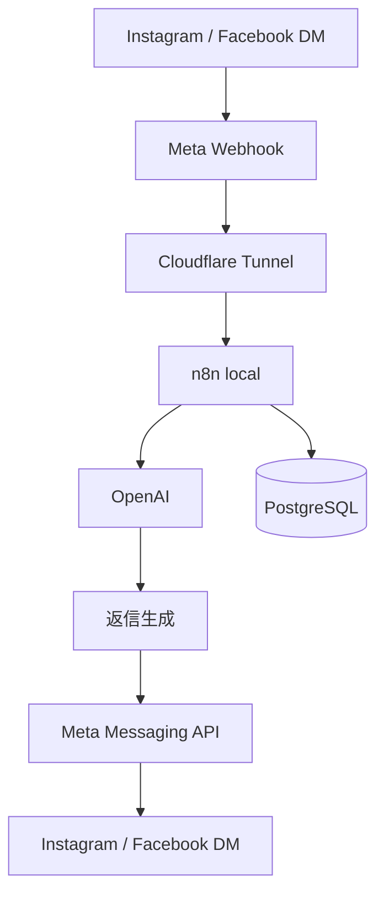

# Architecture

## 概要

Facebook / Instagram の DM 問い合わせを起点に、n8n で AI 営業フローを自動化する。

## MVP範囲

- DM受信
- 会話内容の保存
- AI返信生成
- リード情報の保存
- 商談化候補の通知

## 全体構成

## コンポーネントの役割

- `Meta Webhook`: Instagram / Facebook から DM イベントを受信する入口
- `Cloudflare Tunnel`: ローカルの `n8n` を HTTPS で外部公開する中継
- `n8n local`: Webhook 受信、データ正規化、DB保存、OpenAI 呼び出し、返信送信の制御
- `OpenAI`: 会話履歴とリード情報から自然な返信文を生成
- `PostgreSQL`: leads / conversations / notifications を保持

## リクエストの流れ

1. ユーザーが Instagram / Facebook に DM を送る
2. Meta が Webhook を呼ぶ
3. Cloudflare Tunnel が公開 URL からローカル `n8n` の Webhook へ転送する
4. `n8n` が payload を共通フォーマットへ正規化する
5. `n8n` が lead と incoming message を `PostgreSQL` に保存する
6. `n8n` が直近会話を読み出して OpenAI に渡す
7. OpenAI が返信文を生成する
8. `n8n` が Meta Messaging API へ返信を送信する
9. 送信結果を `PostgreSQL` に保存し、必要なら営業通知を飛ばす

## 運用上の注意

- `WEBHOOK_URL` は Cloudflare Tunnel の公開 URL と一致させる
- Meta の Webhook 検証リクエストに返す `verify_token` を別管理する
- Instagram と Facebook では payload の形が少し異なるので、Webhook 直後に正規化ノードを置く
- 最初は自動送信ではなく、条件付き送信か承認フローを挟む方が安全
